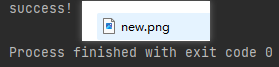

# journals

# 第一篇    集合

学习集合，集合也是Java中重要的一节，学的不好，对开发会有重大的阻碍。血迹总结如下几点：

1. Collection接口的集合有两大类：List和Set

    1. List
          * List的特点是有序，有索引，可重复。
               1. LinkedList: 接口实现类， 链表， 插入删除， 没有同步， 线程不安全
               2. ArrayList: 接口实现类， 数组， 随机访问， 没有同步， 线程不安全
               3. Vector: 接口实现类 数组， 同步， 线程安全; Stack 是Vector类的实现类（已淘汰）
               4. list里一般情况下用ArrayList，特定情况下用LinkedList
    2. Set
        * HashSet 使用hash表（数组）存储元素
        * LinkedHashSet 链表维护元素的插入次序
            Set 底层实现为二叉树，元素排好序
            一般情况下默认用HashSet，如果对查询需求较高的情况下就可以使用LinkedHashSet

2. Map接口是键值对的集合 （双列集合）

    1. Hashtable: 接口实现类， 同步， 线程安全
    2. HashMap: 接口实现类 ，没有同步， 线程不安全
    3. LinkedHashMap: 双向链表和哈希表实现
    4. TreeMap: 红黑树对所有的key进行排序

    在对数据有排序需求的时候可以使用TreeMap, Hashtable是线程安全的，所以他的效率较低, 一般情况下使用HashMap就行了，
    HashMap虽然是线程不安全的，但它的效率高，而且HashMap的key和value能为null，而Hashtable是不能狗存入null的

# 第二篇    Stream


Stream流是链式编程，可以在简洁的代码里写出比较优质的代码，也能让代码的效率提升

   1. Stream流有两种方法种类

      * 终结方法和函数拼接

        1. 生成流

           通过数据源（集合、数组等）生成流。

           例：list.stream()

        2. 函数拼接

           在方法后面可以继续拼接其他方法，直到遇到终结方法后才不能继续拼接，例：
          
           ```java
               List<string> list = new ArrayList<>();
               Collections.addAll(list, "张老三", "张小三", "李四", "赵五", "张六", "王八");
               list.stream().skip(3).forEach(s -> System.out.println("s = " + s));
           
               /*
           		结果：
           			s = 赵五
           			s = 张六
           			s = 王八
               */
           ```
        
           
        
        3. 终结流
        
           一个流只能有一个终结操作，当这个操作执行后，流就被用“光”了，无法再被操作。所以这必定是流的最后一个操作，例：
           
           ```java
               List<String> list = new ArrayList<>();
               Collections.addAll(list, "张老三", "张小三", "李四", "赵五", "张六", "王八");
           
               list.stream().forEach(s -> System.out.println("s = " + s));
               /*
                   结果：
                       s = 张老三
                       s = 张小三
                       s = 李四
                       s = 赵五
                       s = 张六
                       s = 王八
               */
           ```
           
           
        
      
   2. Stream流的常用方法
   
      1. count: 统计个数
      2. forEach: 逐一处理
      3. filter: 过率
      4. limit: 取用前几个
      5. skip: 跳过前几个
      6. map: 映射
      7. concat: 组合

# 第三篇    异常

异常也是Java中必要重要的一节，在必要时候要知道这个异常是什么问题，这个异常该怎么处理。

异常分为两种：编译时异常和运行时异常

1. 编译时异常：

   编译时异常指的是在编译时不能通过的异常，在ide编译器里通常会划横线指出来，在dom面板里用javac进行编译时通常会报错。

   Java里有个Exception类，这个类是所有异常类的父类，某些方法会对外抛出一个异常，让你进行处理，也可以自定义异常，但是必须得继承Exception类

   * 异常的处理

     处理异常的方法有两种，一种是`throws`进行向上抛异常，一种是try...catch

     1. throws

        使用这个方法的时候编译器会给你指出错误，你必须要进行处理，当然到最外层也可以继续抛异常，例：

        ```java
            public static void main(String[] args) throws Exception {
        
                InputStream inputStream = new FileInputStream("myvessel\\src\\com\\shimu\\data.txt");
                byte[] bytes = new byte[3];
                int read = inputStream.read(bytes);
                System.out.println(read);
                String s = new String(bytes);
                System.out.println(s);
        
            }
        
            /*
                输出结果：
                3
                abc
            */
        ```

        如果不使用throws就是下面的结果

        

     2. try...catch

        使用这个方法可以进行捕获异常，在try里面进行捕获异常，捕捉到异常之后会进入到catch里面，可以做对应的逻辑操作，当触发异常之后也必须要执行的操作就可以在catch后面加上finally，finally里面的语句是必须会操作的，例：

        ```java
            public static void main(String[] args) {
        
                InputStream inputStream = null;
                OutputStream outputStream = null;
                try {
                    inputStream = new FileInputStream("C:\\Users\\shimu\\OneDrive\\图片\\屏幕快照\\2022-10-14.png");
                    outputStream = new FileOutputStream("F:\\new.png");
                    byte[] buffer = new byte[1024];
                    int len;
                    while ((len = inputStream.read(buffer)) != -1) {
                        outputStream.write(buffer, 0, len);
                    }
                    System.out.println("success!");
                } catch (Exception e) {
                    e.printStackTrace();
                }finally {
                    try {
                        outputStream.close();
                        inputStream.close();
                    } catch (IOException e) {
                        e.printStackTrace();
                    }
                }
        ```
        
        运行结果：
        
        
   
2. 运行时异常

   运行时异常就是指的在运行的时候才会给你报错，例如：

   ```jvava
       @Test
       public void runtimeExceptionDemo2() {
           int[] arr = {1, 2, 3, 4, 5};
           System.out.println("arr[10] = " + arr[10]);
       }
   
       /*
           运行结果：
           java.lang.ArrayIndexOutOfBoundsException: 10
   
               at com.shimu.test.test.runtimeExceptionDemo2 <27 internal lines>
           此时报了个数组越界异常
       */
   ```

   虽然报错了，但依旧可以使用try..catch进行捕获异常

   ```java
       @Test
       public void runtimeExceptionDemo2() {
           try {
               int[] arr = {1, 2, 3, 4, 5};
               System.out.println("arr[10] = " + arr[10]);
           } catch (Exception e) {
               System.out.println("RuntimeException");
               throw new RuntimeException("数组越界异常");
           }
       }
       /*
           运行结果：
           RuntimeException
   
           java.lang.RuntimeException: 数组越界异常
   
               at com.shimu.test.test.runtimeExceptionDemo2 <27 internal lines>
       */
   ```


# 第四篇   io流

在使用电脑的过程或者使用手机的过程都是会用到io流的，当你电脑上插入一个U盘，可以把一个视频，拷贝到你的电脑硬盘里。那么数据都是在哪些设备上的呢？键盘、内存、硬盘、外接设备等等。

我们把这种数据的传输，可以看做是一种数据的流动，按照流动的方向，以内存为基准，分为`输入input` 和`输出output` ，即流向内存是输入流，流出内存的输出流。

1. 根据数据的流向分为：**输入流**和**输出流**。

   * **输入流**

     把数据从其他设备上读取到内存中的流。 

   * **输出流**

     把数据从内存中写出到`其他设备`上的流。

2. 根据数据的类型分为：**字节流**和**字符流**。

   * **字节流**

     以字节为单位，读写数据的流。

     * InputStzream: 字节输入流的顶级父类
     * OutputStream: 字节输出流的顶级父类

   * **字符流**

     以字符为单位，读写数据的流。

     * Reader: 字符输入流的顶级父类
     * Writer: 字符输出流的顶级父类

# 第五篇   io的其他流

上一篇的io流属于是比较基础的io流，效率比较低，这篇带来的是更加强大，效率更高的流。比如能够高效读写的缓冲流，能够转换编码的转换流，能够持久化存储对象的序列化流等等。这些功能更为强大的流，都是在基本的流对象基础之上创建而来的，就像穿上铠甲的武士一样，相当于是对基本流对象的一种增强。

缓冲流,也叫高效流，是对4个基本的`FileXxx` 流的增强，所以也是4个流，按照数据类型分类：

* **字节缓冲流**：`BufferedInputStream`，`BufferedOutputStream` 
* **字符缓冲流**：`BufferedReader`，`BufferedWriter`

缓冲流的基本原理，是在创建流对象时，会创建一个内置的默认大小的缓冲区数组，通过缓冲区读写，减少系统IO次数，从而提高读写的效率。

1. **字节缓冲流**

   1. 普通流效率如下：
   
      ~~~java
      	@Test
          void BufferedDemo() {
              // 记录开始时间
              long start = System.currentTimeMillis();
              // 创建流对象
              try (
                      FileInputStream fis = new FileInputStream("E:\\3.开发环境\\JDK\\jdk-8u211-windows-x64.exe");
                      FileOutputStream fos = new FileOutputStream("E:\\jdk8.exe")
              ){
                  // 读写数据
                  int b;
                  while ((b = fis.read()) != -1) {
                      fos.write(b);
                  }
              } catch (IOException e) {
                  e.printStackTrace();
              }
              // 记录结束时间
              long end = System.currentTimeMillis();
              System.out.println("普通流复制时间:"+(end - start)+" 毫秒");
          }
      	/*
              输出结果：普通流复制时间:469308 毫秒
          */
      ~~~
   
   2. 缓冲流效率如下：
   
      ~~~java
      	@Test
          void BufferedDemo() {
              // 记录开始时间
              long start = System.currentTimeMillis();
              // 创建流对象
              try (
                      BufferedInputStream bis = new BufferedInputStream(new FileInputStream("E:\\3.开发环境\\JDK\\jdk-8u211-windows-x64.exe"));
                      BufferedOutputStream bos = new BufferedOutputStream(new FileOutputStream("E:\\jdk8.exe"));
              ){
                  // 读写数据
                  int b;
                  while ((b = bis.read()) != -1) {
                      bos.write(b);
                  }
              } catch (IOException e) {
                  e.printStackTrace();
              }
              // 记录结束时间
              long end = System.currentTimeMillis();
              System.out.println("缓冲流复制时间:"+(end - start)+" 毫秒");
          }
          /*
              输出结果：缓冲流复制时间:5665 毫秒
           */
      ~~~


2. **字符缓冲流**


   1. `public BufferedReader(Reader in)` ：创建一个 新的缓冲输入流。

      * BufferedReader：`public String readLine()`: 读一行文字。 

        ~~~java
            @Test
            void BufferedReaderDemo() throws IOException {
                // 创建流对象
                BufferedReader br = new BufferedReader(new FileReader("in.txt"));
                // 定义字符串,保存读取的一行文字
                String line  = null;
                // 循环读取,读取到最后返回null
                while ((line = br.readLine())!=null) {
                    System.out.print(line);
                    System.out.println("------");
                }
                // 释放资源
                br.close();
            }
        ~~~

      * BufferedWriter： `public void newLine()` : 写一行行分隔符,由系统属性定义符号。 

        ~~~java
        	@Test
            void BufferedWriterDemo() throws IOException {
                // 创建流对象
                BufferedWriter bw = new BufferedWriter(new FileWriter("out.txt"));
                // 写出数据
                bw.write("xx");
                // 写出换行
                bw.newLine();
                bw.write("c");
                bw.newLine();
                bw.write("b");
                bw.newLine();
                // 释放资源
                bw.close();
            }
        ~~~

        输出结果：

        

        
        


# 第六篇   Linux

## Linux简介

Linux是作为服务器当中比较广泛的系统，他同样有Windows与macOS一样的图形面板和命令行面板，但与之不同的是，windows与macOS是图形面板比较好用，Linux与之相反，它的图形面板相对来说不是很成熟，命令行面板与其相比更加好用。

Linux可以作为服务器的系统，原因是他更多的是使用命令进行操作系统，故而可以使用第三方软件去连接到服务器去做相应的一些操作，Windows与macOS的命令行不是那么好用，所以国内很多公司都会选择Linux去作为服务器的系统。

## Linux基础命令

1. **Linux命令基础格式** 

   无论是什么命令，用于什么用途，在Linux中，命令有其通用的格式： `command [-options] [parameter]`

   - command：命令本身
   - -options：[可选，非必填]命令的一些参数选项，可以通过选项控制命令的行为细节
   - parameter：[可选，非必填]命令的参数，多数用于命令的只想目标等

2. 基础命令

   1. ls：查看当前目录下的所有文件与文件夹

      当不使用选项和参数，直接使用ls命令本体，表示：以平埔形式，列出当前工作目录下的内容

      

   2. cd/pwd

      1. cd：通过cd命令来更改当前所在的工作目录
      2. pwd：查看当前的工作目录

   3. mkdir：创建文件夹，可以通过`-p`进行创建多层目录

# 第七篇   git 版本控制

* Git 是一个开源的分布式版本控制系统，用于敏捷高效地处理任何或小或大的项目，是 Linus Torvalds 为了帮助管理 Linux 内核开发而开发的一个开放源码的版本控制软件，Git 与常用的版本控制工具 CVS, Subversion 等不同，它采用了分布式版本库的方式，不必服务器端软件支持。

* 可以通过一些命令来控制项目的版本，可以做到迭代版本与回溯版本，在做出更新的时候进行更新版本，出现错误也可以回到以前的某个版本。

## 基本概念

- **工作区：**就是你在电脑里能看到的目录。
- **暂存区：**英文叫 stage 或 index。一般存放在 **.git** 目录下的 index 文件（.git/index）中，所以我们把暂存区有时也叫作索引（index）。
- **版本库：**工作区有一个隐藏目录 **.git**，这个不算工作区，而是 Git 的版本库。

下面这个图展示了工作区、版本库中的暂存区和版本库之间的关系：


## Git 基本操作

Git 的工作就是创建和保存你项目的快照及与之后的快照进行对比。

本章将对有关创建与提交你的项目快照的命令作介绍。


Git 常用的是以下 6 个命令：

* **git clone** ：将远程仓库的代码克隆到本地仓库
* **git push** ：将本地仓库里的代码推送到远程仓库并进行合并
* **git add** ：将新创建或修改后的代码添加到暂存库
* **git commit** ：将暂存库里的代码提交到本地仓库
* **git checkout** ：切换远程仓库的分支
* **git pull** ：拉取远程代码并合并


 ***可以查看我的远程仓库，周记都会搭建成在线文档，每周写的都会上传*** 

[github在线文档](https://shimu115.github.io/wuhanxxcb/) (github可能有点慢，gitee搭建在线文档需要实名就先用github搭建了)

[github仓库](https://github.com/shimu115/wuhanxxcb) 

***周记与总结都以md文档的格式编写的，上传到定岗实习平台后看起来可能有些怪*** 

# 第八篇   序列化与反序列化

## 概念

Serialization（序列化）是一种将对象以一连串的字节描述的过程；反序列化deserialization是一种将这些字节重建成一个对象的过程。将程序中的对象，放入文件中保存就是序列化，将文件中的字节码重新转成对象就是反序列化。

## 对象序列化

* **作用：以内存为基准，把内存中的对象存储到磁盘文件中去，成为对象序列化。** 
* 使用到的流是对象字节输出流：ObjectOutputSteam

## 对象反序列化

* 使用到的流是对象字节输入流：ObjectInputSteam
* **作用：以内存为基准，把存储到磁盘文件中去的对象数据恢复成内存中的对象，成为反序列化。** 

**构造器：** 

* `public ObjectInputStream(InputSteam out)` : 把低级字节输入零六包装成高级的对象字节输入流

**ObjectInputStream序列化方法：** 

* `public Object readObject()` : 把存储到磁盘文件中去的对象数据恢复成内存中的对象返回

## 实现Java对象序列化与反序列化的方法

* **只有实现了Serializable或Externalizable接口的类的对象才能被序列化，否则抛出异常。** 

* 还有一个注意点：如果类的属性包含其他的类，那么那些类也需要实现序列化接口，否则也会报错。

**序列化的API** 

* `java.io.ObjectOutputStream` 代表对象输出流，它的 `writeObject(Object obj)` 方法可对参数指定的obj对象进行序列化，把得到的字节序列写到一个目标输出流中。
* `java.io.ObjectInputStream` 代表对象输入流，它的 `readObject()` 方法从一个源输入流中读取字节序列，再把它们反序列化为一个对象，并将其返回。

# 第九篇   springboot简单介绍

## springboot简介

SpringBoot是由Pivotal团队提供的全新框架，其设计目的是用来简化Spring应用的初始搭建以及开发过程

* spring的缺点
  * 依赖设置繁琐
  * 配置繁琐
* SpringBoot程序优点
  * 起步依赖（简化依赖配置）
  * 自动配置（简化常用工程相关配置）
  * 辅助功能（内置服务器，……）

## springboot 的配置

1. 开发SpringBoot程序要继承spring-boot-starter-parent
2. spring-boot-starter-parent中定义了若干个依赖管理
3. 继承parent模块可以避免多个依赖使用相同技术时出现依赖版本冲突
4. 继承parent的形式也可以采用引入依赖的形式实现效果

**解析：** 

* starter
  * SpringBoot中常见项目名称，定义了当前项目使用的所有依赖坐标，以达到减少依赖配置的目的
* parent
  * 所有SpringBoot项目要继承的项目，定义了若干个坐标版本号（依赖管理，而非依赖），以达到减少依赖冲突的目的
  * spring-boot-starter-parent各版本间存在着诸多坐标版本不同
* 实际开发
  * 使用任意坐标时，仅书写GAV中的G和A，V由SpringBoot提供，除非SpringBoot未提供对应版本V
  * 如发生坐标错误，再指定Version（要小心版本冲突）

**内置服务器：** 

* tomcat(默认)：apache出品，粉丝多，应用面广，负载了若干较重的组件
* jetty：更轻量级，负载性能远不及tomcat
* undertow：undertow，负载性能勉强跑赢tomcat

# 第十篇 常用的配置文件

配置文件常见有三种：

1. xml
2. yml
3. yaml

三种都有各自不同的优缺点

1. xml

   1989年，HTML诞生，它抛弃了SGML复杂庞大的缺点，继承了[SGML](https://baike.baidu.com/item/SGML/2901416?fromModule=lemma_inlink)的很多优点。HTML最大的特点是简单性和跨平台性。随着Web应用的不断发展，HTML的局限性也越来越明显地显现了出来，如HTML无法描述数据、可读性差、搜索时间长等。XML最初的设计目的是为了[EDI](https://baike.baidu.com/item/EDI/1049267?fromModule=lemma_inlink)(Electronic Data Interchange，电子数据交换)，确切地说是为EDI提供一个标准数据格式。( [来源百度百科](https://baike.baidu.com/item/可扩展标记语言?fromtitle=xml文件&fromid=1994443&fromModule=lemma_search-box) )但因为一些开发者认为，html能更方便我们的开发，所以xml并没有变成主流的语言，而渐渐成为了配置的文件。
   
2. yml

   YAML (YAML Ain't a Markup Language)YAML不是一种标记语言，通常以.yml为后缀的文件，是一种直观的能够被电脑识别的数据序列化格式，并且容易被人类阅读，容易和脚本语言交互的，可以被支持YAML库的不同的编程语言程序导入，一种专门用来写配置文件的语言。

3. yaml

   与yml相同，他们的格式是分层级的，相对于xml来说，在看配置的时候能很清楚的看清每个配置，下面是yml和yaml的配置：

   ~~~yml
   server:
     port: 5571
   spring:
     datasource:
       driver-class-name: com.mysql.cj.jdbc.Driver
       url: jdbc:mysql://192.168.101.65:3306/xcplus_system?serverTimezone=UTC&userUnicode=true&useSSL=false&
       username: root
       password: mysql
   logging:
     config: classpath:log4j2-dev.xml
   ~~~

   有数据库、端口的相关配置与日志的相关配置，如果写成xml，就相当繁琐，而且配置会比较多。

# 第十一篇   MySQL的事务

## 四大特性  ACID

- 原子性(Atomicity)：事务是不可分割的最小操作但愿，要么全部成功，要么全部失败
- 一致性(Consistency)：事务完成时，必须使所有数据都保持一致状态
- 隔离性(Isolation)：数据库系统提供的隔离机制，保证事务在不受外部并发操作影响的独立环境下运行
- 持久性(Durability)：事务一旦提交或回滚，它对数据库中的数据的改变就是永久的

## 并发事务

* 脏读：一个事务读到另一个事务还没提交的数据
* 不可重复读  一个事务先后读取同一条记录，但两次读取的数据不同
* 幻读  一个事务按照条件查询数据时，没有对应的数据行，但是再插入数据时，又发现这行数据已经存在

查看事务隔离级别：
`SELECT @@TRANSACTION_ISOLATION;` 
设置事务隔离级别：
`SET [ SESSION | GLOBAL ] TRANSACTION ISOLATION LEVEL {READ UNCOMMITTED | READ COMMITTED | REPEATABLE READ | SERIALIZABLE };` 
SESSION 是会话级别，表示只针对当前会话有效，GLOBAL 表示对所有会话有效

再写代码的时候可以直接使用spring的事务控制：

直接使用注解 `@Transactional` 。

# 第十二篇   MySQL的SQL优化

1. 插入数据

   普通插入：

   1. 采用批量插入
   2. 手动提交事务
   3. 逐渐顺序插入

   如果插入数据超过1000条，不建议使用insert语句，建议使用数据库提供的load指令进行插入，插入较快，性能较高

2. 主键优化

   数据组织方式：在InnoDB存储引擎中，表数据都是根据主键顺序组织存放的，这种存储方式的表称为索引组织表（Index organized table, IOT）

   主键设计原则：

   - 满足业务需求的情况下，尽量降低主键的长度
   - 插入数据时，尽量选择顺序插入，选择使用 AUTO_INCREMENT 自增主键
   - 尽量不要使用 UUID 做主键或者是其他的自然主键，如身份证号
   - 业务操作时，避免对主键的修改

3. order by优化

   1. Using filesort：通过表的索引或全表扫描，读取满足条件的数据行，然后在排序缓冲区 sort buffer 中完成排序操作，所有不是通过索引直接返回排序结果的排序都叫 FileSort 排序
   2. Using index：通过有序索引顺序扫描直接返回有序数据，这种情况即为 using index，不需要额外排序，操作效率高

4. group by优化

   - 在分组操作时，可以通过索引来提高效率
   - 分组操作时，索引的使用也是满足最左前缀法则的

   如索引为`idx_user_pro_age_stat`，则句式可以是 `select ... where profession order by age` ，这样也符合最左前缀法则

5. limit优化

   limit在查询数据量较小的时候可以使用，一旦数据量很多的时候就需要进行优化，例如在 `9000000~9000010` 条数据时，消耗可能会在半分钟左右，他是先进行排序，我们可以通过 `覆盖查询+子查询` 的方式进行优化，官方也是这么给出的优化方式

6. count优化

   MyISAM 引擎把一个表的总行数存在了磁盘上，因此执行 count(\*) 的时候会直接返回这个数，效率很高（前提是不适用where）；
   InnoDB 在执行 count(\*) 时，需要把数据一行一行地从引擎里面读出来，然后累计计数。
   优化方案：自己计数，如创建key-value表存储在内存或硬盘，或者是用redis。

   最好还是用count(*)进行查询，否则会多出二次查询

7. update优化

   InnoDB 的行锁是针对索引加的锁，不是针对记录加的锁，并且该索引不能失效，否则会从行锁升级为表锁。

   如以下两条语句：
   `update student set no = '123' where id = 1;` ，这句由于id有主键索引，所以只会锁这一行；
   `update student set no = '123' where name = 'test';` ，这句由于name没有索引，所以会把整张表都锁住进行数据更新，解决方法是给name字段添加索引

   **update在没有索引的时候，他的行锁会自动升级成表锁，导致整张表都不能进行DML操作，也会降低其他操作的性能** 

   